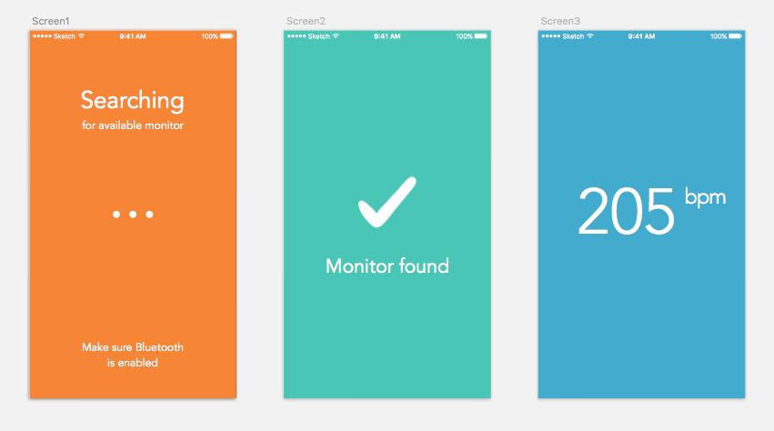

## Beats

A heart rate app for iOS for stationary workouts (treadmill, circuit classes, etc.). Built because I couldn't find a nicely designed, simple heart rate tracker for workouts that didn't involved tracking distance rather than time.

Currently tested and compatible with:
* Polar H7 Heart Rate Monitor
* More to follow ...

### Technology
* Swift 2
* Xcode 7
* XCTest
* UITesting
* Core Bluetooth

One of the biggest technical challenges so far has been creating a mock version of the Core Bluetooth API, made particularly difficult as key objects have no public initializers.

Designed using Sketch.

### To Do
For full development roadmap, head over to the project board [Trello](https://trello.com/b/PrwzpYqY/beats).

Future plans and features include:

* Record workout
* Save workout
* Display workout on scrolling graph
* Pull HeartRateKit out into a framework
* Personalised heart rate zones

### Resources
* [**Core Bluetooth Programming Guide**](https://developer.apple.com/library/ios/documentation/NetworkingInternetWeb/Conceptual/CoreBluetooth_concepts/AboutCoreBluetooth/Introduction.html)

* [**Core Bluetooth Framework Reference**](https://developer.apple.com/library/ios/documentation/CoreBluetooth/Reference/CoreBluetooth_Framework/index.html#//apple_ref/doc/uid/TP40011295)

* [**Polar Developer Resources**](http://developer.polar.com/wiki/H6_and_H7_Heart_rate_sensors)

* [**Bluetooth Developer Portal**](https://developer.bluetooth.org/gatt/services/Pages/ServiceViewer.aspx?u=org.bluetooth.service.heart_rate.xml): Guidance on standards for heart rate measurement services and characteristics.

* [**RZBluetooth**](https://github.com/Raizlabs/RZBluetooth): An open source Objective-C wrapper for Core Bluetooth. Used for inspiration to understand how to test and mock Core Bluetooth. Also I submitted pull request to add Swift example code.
